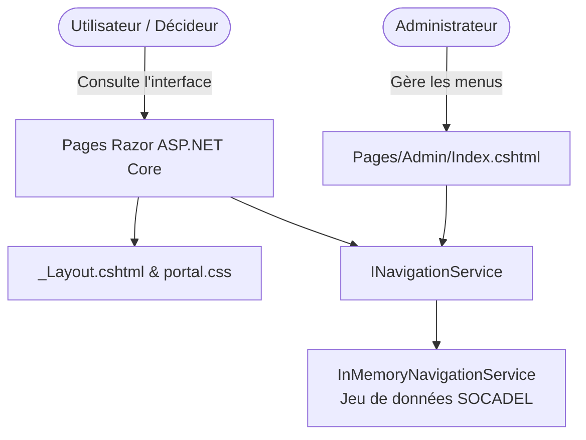

# Portail SOCADEL - Interface de consultation des rapports décisionnels

[](https://dotnet.microsoft.com/)
[](https://learn.microsoft.com/aspnet/core/razor-pages/)
[](https://learn.microsoft.com/dotnet/csharp/)
[](./design-reference/)
[]()

---

## 📋 Table des matières

1. [Présentation du projet](#-présentation-du-projet)
2. [Captures et Maquettes de référence](#-captures-et-maquettes-de-référence)
3. [Technologies utilisées](#-technologies-utilisées)
4. [Structure du projet](#-structure-du-projet)
5. [Fonctionnalités principales](#-fonctionnalités-principales)
6. [Guide d'installation et de lancement](#-guide-dinstallation-et-de-lancement)
7. [Navigation et Paramètres URL](#-navigation-et-paramètres-url)
8. [Note d'architecture & Évolutions futures](#-note-darchitecture--évolutions-futures)

---

## 🎯 Présentation du projet

Le **Portail SOCADEL** est une application web d'entreprise conçue pour **centraliser et unifier l'accès aux rapports décisionnels** (tableaux de bord Microsoft Power BI et rapports paginés SQL Server Reporting Services - SSRS) de la société **SOCADEL** (*Société Camerounaise d'Électricité*).

Il propose aux collaborateurs et décideurs une interface épurée, performante et intuitive pour naviguer à travers les indicateurs clés de performance (KPI) des différentes directions (Commercial, Finance, Technique, etc.).

> [!NOTE]
> **Avertissement - État actuel du projet :**  
> Ce projet constitue actuellement la **phase Front-End / Prototype applicatif interactif**. Il intègre un jeu de données de démonstration en mémoire (`InMemoryNavigationService`) et simule l'affichage des rapports. Aucune connexion réelle vers un serveur Power BI Embedded ou SSRS n'est active pour le moment.

---

## 🖼️ Captures et Maquettes de référence

L'interface a été conçue en respectant strictement les maquettes graphiques de référence (disponibles dans le répertoire [`design-reference/`](./design-reference/)) :

| Référence | Fichier | Description détaillée de l'interface |
| :--- | :--- | :--- |
| **Interface 01** | [`interface-01-rapport-actif.png`](./design-reference/interface-01-rapport-actif.png) | **Vue Rapport Actif :** Affichage complet d'un rapport sélectionné (*ex: Recouvrement > Rapport A*) avec le bandeau Power BI supérieur, la grille de tuiles de visualisation (courbes, diagrammes en barres, métriques) et le fil d'Ariane synchronisé. |
| **Interface 02** | [`interface-02-accueil.png`](./design-reference/interface-02-accueil.png) | **Écran d'Accueil :** Vue par défaut au lancement présentant l'icône graphique centrale, le message de bienvenue et les 3 cartes d'accès rapide aux rapports fréquents (*Recouvrement*, *Facturation*, *Encaissement*). |
| **Interface 03** | [`interface-03-erreur.png`](./design-reference/interface-03-erreur.png) | **État d'Erreur :** Vue affichée en cas d'échec de chargement du rapport, dotée d'un pictogramme d'avertissement triangulaire, d'un message explicite et d'un bouton d'action vert « Réessayer ». |
| **Identité** | [`logo-socadel.jpg`](./design-reference/logo-socadel.jpg) | **Logo Officiel :** Intégré dans l'en-tête de la barre latérale gauche et dans les en-têtes officiels. |

---

## 🛠️ Technologies utilisées

L'application repose sur un socle technique robuste, moderne et léger :

- **Backend / Serveur :**
  - **C# 12**
  - **ASP.NET Core 8.0** avec le modèle **Razor Pages** pour un rendu serveur rapide et un cycle de vie page par page maîtrisé.
  - **Injection de Dépendances (DI)** native pour découpler la gestion des menus et des services.
- **Frontend / Client :**
  - **HTML5 sémantique** optimisé pour l'accessibilité et la fluidité.
  - **Vanilla CSS (Design System sur-mesure)** : Aucun framework CSS lourd n'est imposé. Utilisation complète de variables CSS (`--socadel-green: #7CB342`, `--socadel-blue: #1D70B8`, etc.), flexbox et CSS grid pour une réactivité parfaite.
  - **JavaScript ES6+** : Gestion interactive du menu arborescent (accordéons, chevron animé), filtrage dynamique côté client, recherche instantanée et modales de gestion administrative.
- **Moteurs Décisionnels cibles :**
  - **Microsoft Power BI** (visualisations interactives, tableaux de bord de synthèse).
  - **Microsoft SSRS** (rapports opérationnels, listings détaillés et balances âgées).

---

## 📁 Structure du projet

```plaintext
PortailSocadel/
├── design-reference/                 # Maquettes et captures d'écran de référence
│   ├── interface-01-rapport-actif.png
│   ├── interface-02-accueil.png
│   ├── interface-03-erreur.png
│   └── logo-socadel.jpg
├── Models/                           # Modèles de données de l'application
│   └── MenuItem.cs                   # Entité hiérarchique (Catégorie, Sous-catégorie, Rapport)
├── Pages/                            # Pages Razor et code-behind
│   ├── Admin/                        # Espace d'administration de l'arborescence
│   │   ├── Index.cshtml              # Tableau de bord CRUD des rapports et rubriques
│   │   └── Index.cshtml.cs           # Gestionnaires OnGet, OnPostAdd, OnPostEdit, OnPostDelete, OnPostReset
│   ├── Shared/                       # Mises en page et vues partielles partagées
│   │   ├── _Layout.cshtml            # Layout principal avec Sidebar SOCADEL et Header
│   │   ├── _Layout.cshtml.css        # Styles scopés de layout
│   │   └── _ValidationScriptsPartial.cshtml
│   ├── _ViewImports.cshtml           # Directives globales Razor
│   ├── _ViewStart.cshtml             # Configuration de layout par défaut
│   ├── Error.cshtml                  # Page d'erreur générique HTTP/Serveur
│   ├── Error.cshtml.cs
│   ├── Index.cshtml                  # Vue principale (Accueil / Rapport Power BI / Erreur)
│   ├── Index.cshtml.cs               # Routage logique des états et fil d'Ariane
│   ├── Privacy.cshtml
│   └── Privacy.cshtml.cs
├── Properties/
│   └── launchSettings.json           # Profils d'exécution locale (.NET Kestrel / IIS Express)
├── Services/                         # Logique métier et accès aux données
│   ├── INavigationService.cs         # Contrat d'interface du service de navigation
│   └── InMemoryNavigationService.cs  # Implémentation avec données d'arborescence SOCADEL
├── wwwroot/                          # Fichiers statiques servis au navigateur
│   ├── css/
│   │   ├── portal.css                # Feuille de styles principale du portail
│   │   └── site.css                  # Compléments et resets globaux
│   ├── images/
│   │   └── logo-socadel.jpg          # Logo d'entreprise SOCADEL
│   ├── js/
│   │   ├── portal.js                 # Logique client (accordéon, recherche, modales)
│   │   └── site.js                   # Scripts complémentaires
│   └── favicon.ico
├── appsettings.json                  # Configuration applicative
├── appsettings.Development.json
├── Program.cs                        # Point d'entrée de l'application & configuration des services
├── PortailSocadel.csproj             # Fichier projet .NET 8 SDK
└── README.md                         # Documentation officielle du projet
```

---

## ✨ Fonctionnalités principales

### 1. 🌳 Navigation Arborescente Dynamique (3 Niveaux)
- **Niveau 1 (Catégories) :** Direction Commerciale, Finance & Comptabilité, etc.
- **Niveau 2 (Sous-menus / Modules) :** Encaissement, Facturation, Recouvrement, Abonnement, Suivi des compteurs, Fraude & Contentieux, etc.
- **Niveau 3 (Rapports décisionnels) :** Rapport A, Rapport B, etc.
- **Interactions :** Dépliement/repliement avec chevrons animés, mémorisation de l'état actif, surbrillance du rapport consulté, synchronisation automatique du **fil d'Ariane** (Breadcrumb).

### 2. 📊 Consultation des Rapports Intégrés
- Intégration visuelle fidèle aux dashboards Power BI avec barre d'en-tête dédiée.
- Grille responsive de tuiles analytiques (graphiques de tendance temporelle, histogrammes, visualisations donut, indicateurs clés de performance).

### 3. 🔄 Gestion Complète des États de l'Application
- **État d'Accueil (`IsHome`) :** Affiche l'écran de bienvenue avec raccourcis directs vers les rapports les plus consultés.
- **État Rapport Actif :** Rendu instantané du rapport sélectionné.
- **État d'Erreur (`IsError`) :** Prise en charge des défaillances de chargement avec bouton « Réessayer ».
- **État de Chargement :** Animations de transition et indicateurs visuels lors de la navigation.

### 4. 🔍 Recherche Globale Instantanée
- Barre de recherche intégrée dans le panneau latéral.
- Filtrage en temps réel des catégories, sous-menus et rapports correspondant aux mots-clés saisis.

### 5. ⚙️ Espace d'Administration de l'Arborescence (`/Admin`)
- **Indicateurs clés :** Statistiques en temps réel sur le nombre de catégories, sous-menus et rapports.
- **Opérations CRUD complètes :**
  - Ajout d'une nouvelle rubrique ou d'un nouveau rapport.
  - Modification d'un élément existant (titre, type, parent, ordre, moteur Power BI/SSRS, description).
  - Suppression sécurisée avec boîte de dialogue de confirmation.
- **Filtres de gestion :** Filtrage textuel et filtrage par niveau hiérarchique.
- **Réinitialisation en un clic :** Bouton pour rétablir instantanément l'arborescence par défaut de SOCADEL.

---

## 🚀 Guide d'installation et de lancement

### Prérequis
- **[.NET 8.0 SDK](https://dotnet.microsoft.com/download/dotnet/8.0)** ou version ultérieure installée sur votre machine.
- Un terminal (Bash, PowerShell, Invite de commandes) ou un IDE moderne (*Visual Studio 2022*, *VS Code* avec extension C# Dev Kit, *JetBrains Rider*).

### Étapes d'exécution

1. **Ouvrir le terminal** à la racine du projet :
   ```bash
   cd /home/ubuntu/Documents/PortailSocadel
   ```

2. **Restaurer les dépendances NuGet :**
   ```bash
   dotnet restore
   ```

3. **Compiler le projet :**
   ```bash
   dotnet build
   ```

4. **Démarrer le serveur de développement :**
   ```bash
   dotnet run
   ```
   *Alternative avec rechargement à chaud (Hot Reload) :*
   ```bash
   dotnet watch run
   ```

5. **Accéder à l'application :**
   Ouvrez votre navigateur web à l'une des adresses indiquées dans la console (par défaut) :
   - HTTP : [`http://localhost:5138`](http://localhost:5138)
   - HTTPS : [`https://localhost:7179`](https://localhost:7179)

---

## 🧭 Navigation et Paramètres URL

Le portail permet de tester facilement les différents états via des paramètres d'URL :

| URL / Paramètre | Résultat affiché |
| :--- | :--- |
| `/` ou `/?report=home` | **Écran d'accueil** avec raccourcis rapides. |
| `/?report=rep-rec-a` | **Rapport Recouvrement > Rapport A** (conforme à la maquette de référence 01). |
| `/?report=rep-fac-a` | **Rapport Facturation > Rapport A**. |
| `/?report=rep-enc-a` | **Rapport Encaissement > Rapport A**. |
| `/?error=true` | **Écran d'erreur de chargement** avec bouton de relance (conforme à la maquette de référence 03). |
| `/Admin` | **Console d'administration** pour créer, éditer, supprimer et réinitialiser les menus. |

---

## 📌 Note d'architecture & Évolutions futures

Ce projet a été initialisé en tant que **socle d'expérience utilisateur (Front-End & Structure de navigation)**.

### Architecture actuelle


### Roadmap pour l'intégration Back-End & Production
- 🔐 **Authentification d'Entreprise :** Intégration du protocole OpenID Connect / Azure Active Directory (Microsoft Entra ID) avec gestion des rôles (Lecteur, Rédacteur, Administrateur).
- ⚡ **Intégration Power BI Embedded :** Intégration du SDK `Microsoft.PowerBI.Api` et du composant JavaScript client (`powerbi-client`) pour l'incorporation sécurisée des rapports avec génération de jetons d'accès (*Embed Tokens*).
- 📑 **Connecteur SSRS Report Server :** Intégration d'un visualiseur de rapports SSRS avec passage de paramètres d'exécution.
- 💾 **Persistance des Menus en Base de Données :** Remplacement de `InMemoryNavigationService` par un service basé sur Entity Framework Core (SQL Server / PostgreSQL).

---

© **SOCADEL - Société Camerounaise d'Électricité** — Direction des Systèmes d'Information & Décisionnel.
