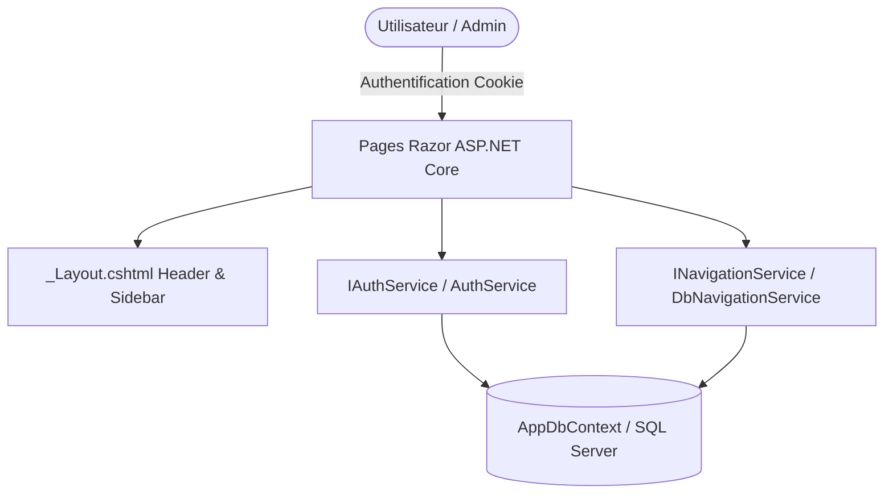

# Portail SOCADEL - Application Web Décisionnelle & Administration

[](https://dotnet.microsoft.com/)
[](https://learn.microsoft.com/aspnet/core/razor-pages/)
[](https://learn.microsoft.com/ef/core/)
[](https://www.microsoft.com/sql-server/)
[](https://learn.microsoft.com/dotnet/csharp/)

Le **Portail SOCADEL** est une application web d'entreprise développée en **ASP.NET Core 8 (Razor Pages)** et **Entity Framework Core**. Elle centralise et sécurise l'accès aux tableaux de bord et rapports décisionnels de la société **SOCADEL** (*Société Camerounaise d'Électricité*).

---

## 🚀 Fonctionnalités Principales

- 🔐 **Authentification & Gestion des Rôles (SQL Server / EF Core)**
  - Authentification sécurisée par cookies (`AddCookie`).
  - Hachage de mot de passe SHA-256.
  - Gestion des rôles : **Admin** (accès complet à la console de gestion) et **User** (consultation de la plateforme).
- 🌳 **Navigation Arborescente Dynamique Persistante (3 niveaux)**
  - Niveaux : Catégories, Sous-menus et Rapports décisionnels.
  - CRUD complet (Ajout, Modification, Suppression) directement persisté en base de données SQL Server via `DbNavigationService`.
  - Reconstitution d'arborescence récursive et calcul d'ordre automatique.
- 🎨 **Interface Moderne & Responsive**
  - Design sur-mesure Vanilla CSS avec variables personnalisées (`#1D70B8`, `#7CB342`).
  - Barres de recherche globales instantanées et fil d'Ariane dynamique.

---

## 🛠️ Architecture & Technologies

- **Backend :** C# 12, ASP.NET Core 8.0 Razor Pages, Entity Framework Core 8.0.
- **Base de Données :** SQL Server (production / stockage permanent) & Mode In-Memory (développement rapide).
- **Sécurité :** ASP.NET Core Cookie Authentication & Protection des routes selon les claims et rôles.
- **Frontend :** HTML5, Vanilla CSS3, JavaScript ES6+ (accordéons, modales, recherche filtrante).



---

## 🔐 Comptes de Démonstration (Seeded)

Lors du premier démarrage, la base de données s'initialise automatiquement avec les comptes suivants :

| Rôle | Email | Mot de passe | Description |
| :--- | :--- | :--- | :--- |
| 👑 **Admin** | `admin@socadel.cm` | `Admin123!` | Administrateur (Accès console `/Admin`) |
| 👤 **User** | `user@socadel.cm` | `User123!` | Utilisateur (Naomi TSAGUE) |

---

## ⚙️ Configuration & Base de Données

Le fichier `appsettings.json` permet de basculer le fournisseur de base de données :

```json
{
  "DatabaseProvider": "SqlServer",
  "ConnectionStrings": {
    "DefaultConnection": "Server=127.0.0.1;Database=PortailSocadelDb;User Id=sa;Password=Socadel2024!;TrustServerCertificate=True;"
  }
}
```

Pour utiliser SQL Server localement :
1. Définissez `"DatabaseProvider": "SqlServer"`.
2. Assurez-vous que SQL Server est démarré (`sudo systemctl start mssql-server`).

---

## 💻 Démarrage Rapide

```bash
# 1. Compiler le projet
dotnet build

# 2. Lancer l'application
dotnet run
```

Accédez ensuite à l'application dans votre navigateur : **`http://localhost:5138`**

---

© **SOCADEL - Société Camerounaise d'Électricité** — Direction des Systèmes d'Information & Décisionnel.
